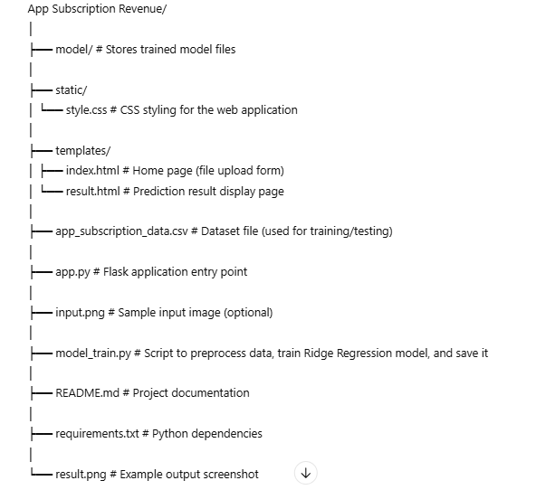
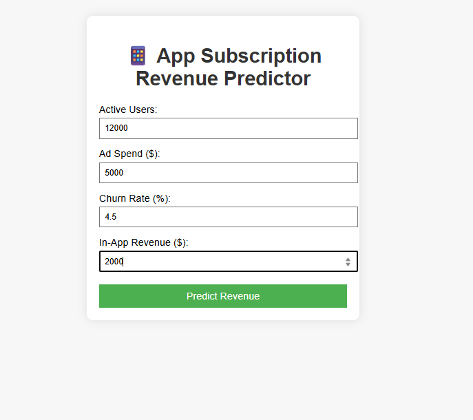
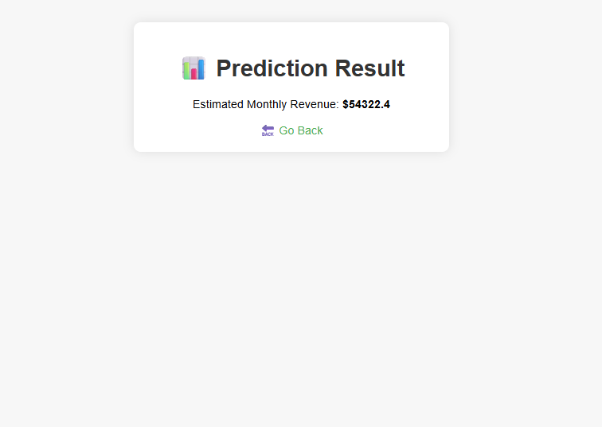

# App Subscription Revenue Prediction using Ridge Regression

## Overview
This project predicts monthly app subscription revenue using **Ridge Regression**, a linear regression technique with L2 regularization.  
The model is trained on historical subscription data to provide accurate revenue forecasts while avoiding overfitting.

## Features
- Reads and preprocesses the dataset  
- Extracts time-based features (e.g., Month) from the date column  
- Implements Ridge Regression for prediction  
- Evaluates model performance using MAE, MSE, RMSE, and R² score

## Dataset
- **Input**: A CSV file containing historical subscription revenue data.  
- **Required Columns**:
  - `Date` – The date of the revenue record  
  - `Revenue` – The subscription revenue amount for that date  

The dataset should be cleaned before running the model (no missing or invalid values).

## Technologies Used
- Python 3.x  
- pandas  
- numpy  
- scikit-learn  

## Project Structure

## Installation
1. Clone the repository:

   git clone https://github.com/username/app-subscription-revenue.git
   cd app-subscription-revenue

2.Install dependencies:

pip install -r requirements.txt
## Usage
1.Train the Model (optional if model folder already contains a trained model):

python model_train.py

2.Run the Web App:

python app.py

3.Open the application in your browser at:

http://127.0.0.1:5000/

4.Upload the dataset and view the prediction results.

## Example Output
- Prediction Results Page
Displays predicted revenue and corresponding visual output.

## Model Evaluation
The Ridge Regression model is evaluated using:

-MAE (Mean Absolute Error)

-MSE (Mean Squared Error)

-RMSE (Root Mean Squared Error)

-R² Score

## Screenshots

## Input form

## Result page

