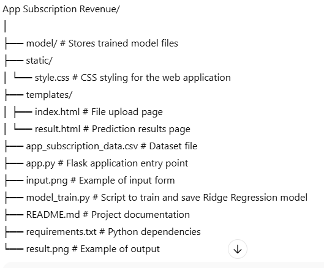

# App Subscription Revenue Prediction (Ridge Regression)

A **Flask-based Machine Learning web application** that predicts monthly app subscription revenue using **Ridge Regression**.  
The application processes historical subscription data to provide accurate revenue forecasts.

---

### Overview
This project allows users to upload subscription revenue data and view predictions through a simple web interface.  
It uses **feature engineering** (such as extracting the month from the date) and **Ridge Regression** to make accurate predictions.

---

### Features
- Predicts monthly app subscription revenue  
- Uses **Ridge Regression** with L2 regularization to reduce overfitting  
- Accepts dataset in CSV format  
- Interactive **HTML/CSS frontend**  
- Flask-powered real-time prediction  

---

### Tech Stack
- **Python 3.x**  
- **Flask**  
- **scikit-learn**  
- **pandas**, **numpy**  
- **HTML/CSS**  

---

### Project Structure

---

### Installation & Setup

### 1. Clone the Repository

git clone https://github.com/yourusername/app-subscription-revenue.git
cd app-subscription-revenue

### 2. Install Dependencies

pip install -r requirements.txt

### 3. Train the Model

python model_train.py
This will create and save the trained model file inside the model directory.

### 4. Run the Web App

python app.py
Open in your browser:

http://127.0.0.1:5000/

### Screenshots
## Input page

## Result Page

### Use Cases
- Revenue forecasting for subscription-based applications

- Data-driven business decision-making

- Demonstration of Ridge Regression in real-world applications

### Future Enhancements
- Integrate database storage for uploaded datasets

- Add model comparison with other regression algorithms

- Deploy online via platforms such as Heroku or Render
